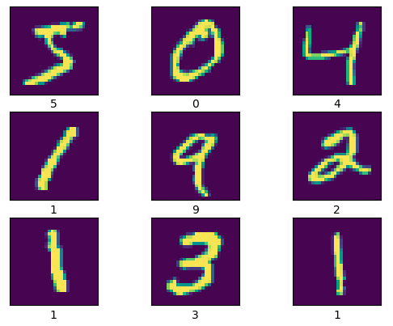

# Image Classification Ai

image classification projects

- cifar10 image classification
- fashion

### Cifar 10

Using the cifar 10 image classification dataset

- Loss: Sparse Categorical Crossentropy
- Optimizer: Adam
- Metrics: Accuracy
- Learning Rate: 0.001
- Batch Size: 32

**Train loss:** 0.6438 , **Train accuracy:** 0.7757

**Test loss:** 0.8629 , **Test accuracy:** 0.7077

### Mnist

Sequential Api

- Loss: Sparse Categorical Crossentropy
- Optimizer: Adam
- Metrics: Accuracy
- Learning Rate: 0.001
- Batch Size: 32
- Epochs: 5

**Train loss:** 0.0578 , **Train accuracy:** 0.9805

**Test loss:** 0.0715 , **Test accuracy:** 0.9799

